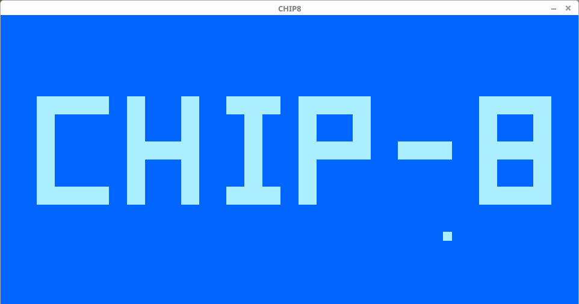
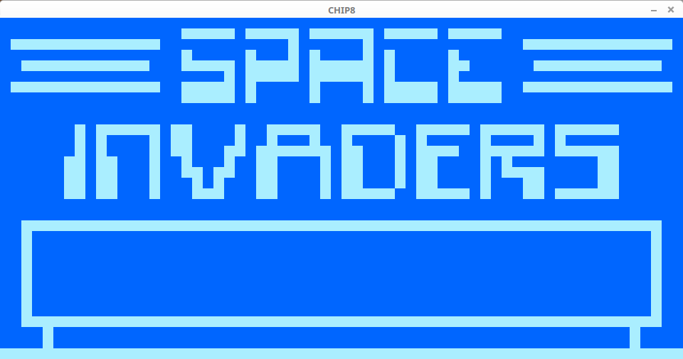
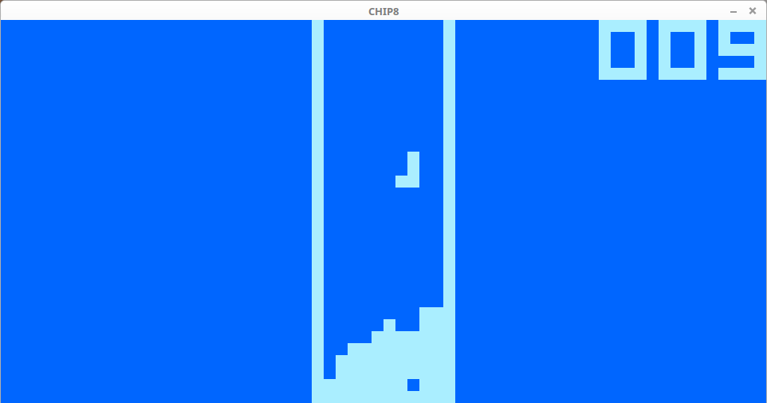

# CHIP-8 Emulator

A CHIP-8 emulator written in pure C.

## Screenshots







## Building

```bash
sudo apt-get install libsdl2-dev
gcc -O3 -Wall -Wno-unused-result chip8.c -o chip8 -lSDL2main -lSDL2
```

### Advanced Options

If you edit `chip8.c`, you will find near the top of the file a list of variables which can be edited to modify the ticks per frame, speed, scale, color, and keymap of the emulator.

## Running

```bash
./chip8 <ROM>
```

If no rom is specified, the default `BOOT1` rom will be used.

### Keyboard Shortcuts

Ctrl + Q = Quit
Ctrl + P = Pause
Ctrl + R = Reset
Ctrl + Plus = Speed Up
Ctrl + Minus = Slow Down
Ctrl + 0 = Reset Speed
